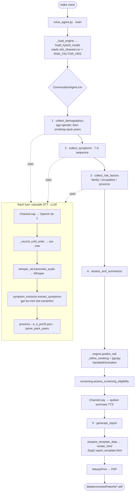

# Praevidio AI — System Architecture

This document explains how the system is wired together: orchestration approach,
component layers, RAG, the models we use, and the end-to-end execution order from
`make voice` to the final report. A visual flow diagram is at the end.

---

## 1. Orchestration approach

**We do not use an agent-orchestration framework.** The conversation is driven by a
hand-written Python **state machine** (`src/conversation/voice_agent.py`): for each
step we explicitly *ask → listen → extract → re-ask if a required slot is missing*.

This is a deliberate choice. The flow is a deterministic clinical questionnaire with
a fixed set of slots; a framework's abstractions would add complexity without value.
The "intelligence" is not an LLM agent loop — it is the **Bayesian network**; the LLM
is only a translator from natural language to structured evidence.

> Note: `langchain*` previously appeared in `requirements.txt` but was never imported
> in `src/`; it has been removed. RAG is done directly with the ChromaDB client.

**When a framework would help, and the alternatives:**

| Framework | Good for | Fit here |
|---|---|---|
| LangChain / **LangGraph** | chains, tool-calling, graph-based flows | LangGraph could standardize our state machine; not required |
| LlamaIndex | RAG-heavy apps (indexing, retrievers) | our RAG is simple; not needed |
| Google ADK | multi-agent, Gemini ecosystem | we use OpenAI; not a natural fit |
| OpenAI Agents SDK | lightweight multi-agent + tools | single agent; not needed |
| CrewAI / AutoGen | multiple cooperating agents (roles) | overkill for one agent |
| Semantic Kernel | enterprise .NET/Python, planners | not needed |

If the system grows into a **multi-agent, dynamic tool-selecting** design, LangGraph
or the OpenAI Agents SDK would be the natural upgrade.

---

## 2. Component layers

```
OFFLINE (preparation):
  NLST raw data ──> nlst_data_preprocessing.py ──> nlst_cleaned.csv
                                                       │
  knowledge_base/*.json ──> rag_pipeline.py ──> ChromaDB index (ICD-10)

RUNTIME (each session):
  Voice / Text
     │  STT (Whisper)
     ▼
  Slot extraction (GPT-4o-mini / keyword)  ── province→PM2.5, pack-years
     │
     ▼
  [RAG ICD-10 mapping — only in the pipeline.py flow]
     │
     ▼
  Hybrid BBN inference (pgmpy)  + pack-year smoking refinement
     │
     ▼
  Screening eligibility (symptom-independent)
     │
     ├──> Spoken summary (TTS)
     └──> PDF report (Jinja2 + WeasyPrint)
```

The core reasoning is the **Bayesian Belief Network** (`pgmpy`), chosen for
explainability and auditability; the LLM only converts free text into structured
evidence.

---

## 3. What "slot extraction" means (GPT-4o-mini)

**Slot filling** = turning a free-form sentence into a fixed set of structured fields
("slots"). We give GPT-4o-mini a strict instruction: *read this Turkish sentence and
return a JSON object with these exact keys; use 1/0/null.* The model never makes a
medical decision — it only fills the form.

Example:

```
User says:  "67 yaşında erkeğim, günde bir paket sigara içiyorum,
             öksürüyorum ve kan tükürdüm. Konya'da yaşıyorum."

GPT-4o-mini returns (the "slots"):
{ "AGE_EXACT": 67, "AGE": 3, "GENDER": 1, "SMOKING": 1,
  "CIGARETTES_PER_DAY": 20, "YEARS_SMOKED": null,
  "COUGHING": 1, "HEMOPTYSIS": 1, "SHORTNESS_OF_BREATH": 0, ...,
  "FAMILY_HISTORY": null, "ASBESTOS": null, "PROVINCE": "Konya" }

Post-processing (symptom_extractor.py):
  PROVINCE "Konya" → tr_il_pm25.json → AIR_POLLUTION = 2 (high)
  CIGARETTES_PER_DAY × YEARS_SMOKED → _pack_years
```

The resulting evidence dict is exactly what `HybridLungCancerEngine.predict_risk()`
expects. Two modes exist: **`llm`** (GPT-4o-mini, semantic, robust to phrasing) and
**`keyword`** (offline keyword matching, no API key). `null` means "not mentioned" →
left unobserved (the BBN marginalizes it), which is different from an explicit 0.

Why GPT-4o-mini specifically: it is cheap, fast, and accurate enough for structured
extraction with `temperature=0` and a JSON-only instruction. We don't need a frontier
model because the task is constrained (fill a known schema), not open-ended reasoning.

---

## 4. RAG and ChromaDB

**Purpose:** map free-text symptom phrases ("göğsümde baskı var") to **ICD-10 codes**
from a curated knowledge base (`knowledge_base/icd10_lung_codes.json`). *(Used in the
`pipeline.py` flow; the `make voice` agent goes straight to the BBN and does symptom →
evidence mapping with the LLM/keyword extractor instead.)*

**How ChromaDB works:**
1. Each document is turned into an **embedding** (OpenAI `text-embedding-3-small`,
   ~1536-dim vector); semantically similar texts land close together.
2. Vectors are stored in a persistent local store (`data/chroma_db/`: SQLite + binary
   index files).
3. A query is embedded the same way; ChromaDB does **approximate nearest-neighbor**
   search (HNSW graph, cosine similarity) and returns the top-k closest documents.
4. With no API key, we fall back to ChromaDB's local `DefaultEmbeddingFunction`
   (sentence-transformers) so the demo works offline.

Alternative vector DBs: FAISS (library), Qdrant, Weaviate, Milvus, pgvector. Chroma
was chosen for zero-setup, local, persistent development.

---

## 5. Models and alternatives

| Layer | We use | Alternatives |
|---|---|---|
| STT | OpenAI `whisper-1` | faster-whisper / whisper.cpp (local), Google STT, Azure Speech, Deepgram, AssemblyAI |
| Reasoning / extraction | `gpt-4o-mini` | GPT-4o, Claude, Gemini; local Llama-3/Mistral; fine-tuned small model |
| TTS | OpenAI `tts-1` | ElevenLabs, Azure/Google TTS, local Coqui XTTS / Piper |
| Embeddings | `text-embedding-3-small` | BGE-m3, multilingual-e5 (good for Turkish), Cohere, local sentence-transformers |
| Risk engine | `pgmpy` (Bayesian network) | pomegranate, custom Bayes implementation |

Because the product is Turkish-first, future options include faster-whisper (cost /
privacy) for STT and multilingual-e5 for embeddings.

---

## 6. Execution order: `make voice` → report

```
Makefile  (target: voice)
   └─> python src/conversation/voice_agent.py --channel voice --nlp-mode llm

src/config.py ............ loaded on import (paths, model names, thresholds)

voice_agent.py: main()
   └─ ConversationAgent._load_engine()
        └─ model/hybrid_bayesian_network.py : build_hybrid_model()
             ├─ read nlst_cleaned.csv → P(cancer | age,gender,smoking) CPT
             ├─ expand CPT with RISK_FACTOR_ORS (family/asbestos/air OR)
             └─ HybridLungCancerEngine ready

ConversationAgent.run():
 1) collect_demographics()        [2 questions: age+gender, then smoking+pack-years]
      Channel.say(...)            → OpenAI tts-1 (afplay)
      Channel.listen()
        └─ _record_until_enter()  → sox 'rec' (auto-start / ENTER to stop) → .wav
      stt/whisper_stt.py: transcribe_audio()   → Whisper → text
      nlp/symptom_extractor.py: extract_symptoms(mode="llm")
        ├─ extract_with_llm()     → gpt-4o-mini, JSON slot extraction
        ├─ resolve_air_pollution()→ knowledge_base/tr_il_pm25.json (province→tier)
        └─ model/screening.py: parse_pack_years()  → pack-years

 2) collect_symptoms()            [7 symptoms in sequence] → STT → parse_yes_no/extractor
 3) collect_risk_factors()        [family, occupation, province] → resolve_air_pollution

 4) assess_and_summarize()
      engine.predict_risk(evidence)
        ├─ _refine_smoking()      → pack-year adjustment (never / heavy-former)
        └─ pgmpy VariableElimination → P(cancer | all evidence) = risk score
      model/screening.py: assess_screening_eligibility()   → screening flag
      Channel.say(summary)        → OpenAI tts-1 (spoken summary + screening note)

 5) _generate_report()
      report/report_generator.py: generate_report()
        ├─ prepare_template_data()→ risk + risk_drivers + screening + smoking_note
        ├─ render_html()          → Jinja2 + templates/report_template.html
        └─ WeasyPrint             → .pdf  (data/processed/reports/)
```

---

## 7. Visual flow diagram (`make voice`)


